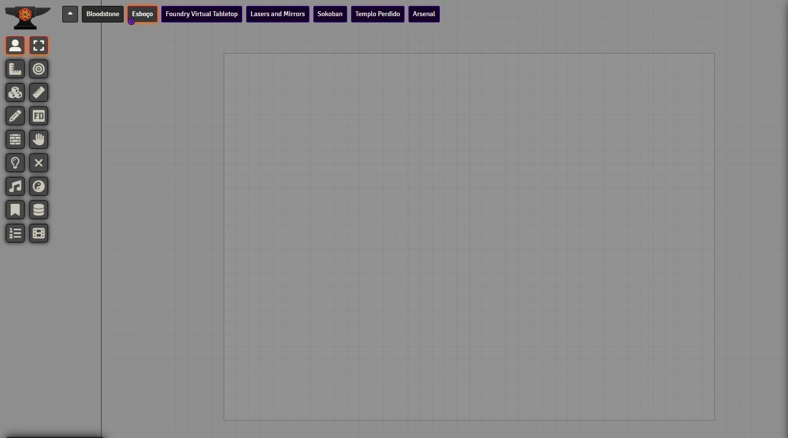
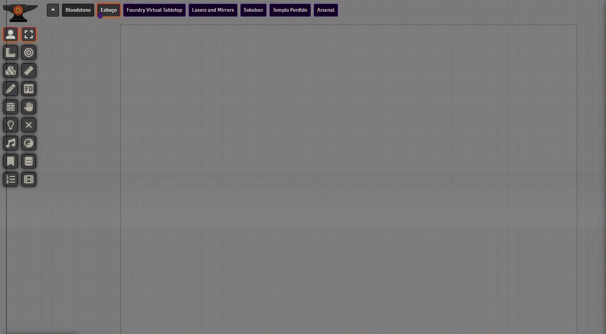

# Old CRT Effects
This module adds to the screen visual effects of a old monitor.

## Effects Off
<p align="center">
  
</p>

## Effects On
<p align="center">
  
</p>

# Instalation
You can install using the manifest: https://raw.githubusercontent.com/brunocalado/old-crt-effects/main/module.json

## Localization

If you want to translate this module [DOWNLOAD THIS FILE](https://raw.githubusercontent.com/brunocalado/old-crt-effects/main/lang/en.json) and translate it. After that open an issue sharing your translation. 

You also need to share with me the default name convention for your language. This is very easy to get. 
- Find a system or module which is translated to your language. 
- Open the **module.json** or **system.json** file.
- You should find something like the code above. It's under **languages**. Share with me **lang, name and path** for your language.
```json
{
  "lang": "en",
  "name": "English",
  "path": "lang/en.json"
},
{
    "lang": "fr",
    "name": "Français",
    "path": "lang/fr.json"
}  
```

# LICENSE
[LICENSE](https://github.com/brunocalado/old-crt-effects/blob/main/LICENSE)

This is a fork from https://github.com/prolice/swffgUI-cc

# Mestre Digital
About this module creator: https://sites.google.com/view/mestredigitalmodules
