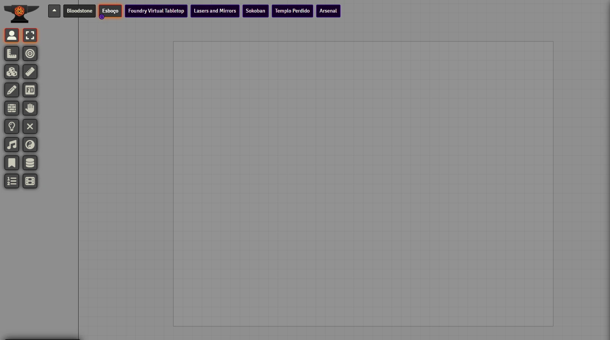
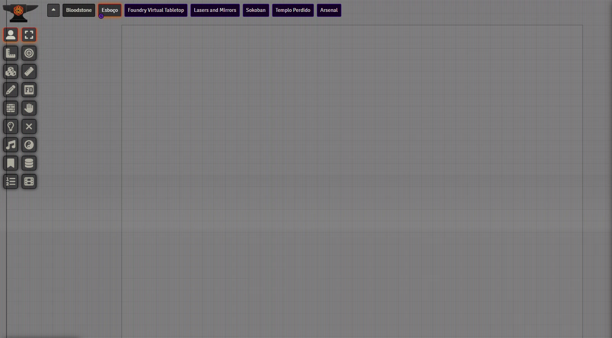

# Old CRT Effects

This module adds to the screen visual effects of a old monitor.

## Effects Off

<p align="center">
  
</p>

## Effects On

<p align="center">
  
</p>

# Instalation
You can install using the manifest:

```js
https://raw.githubusercontent.com/brunocalado/old-crt-effects/main/module.json
```

# LICENSE

[LICENSE](https://github.com/brunocalado/old-crt-effects/blob/main/LICENSE)

This is a fork from https://github.com/prolice/swffgUI-cc

# Mestre Digital

About this module creator: https://sites.google.com/view/mestredigitalmodules
